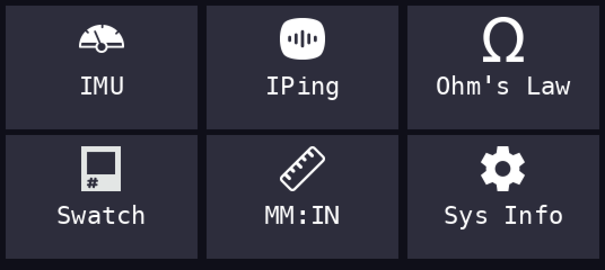
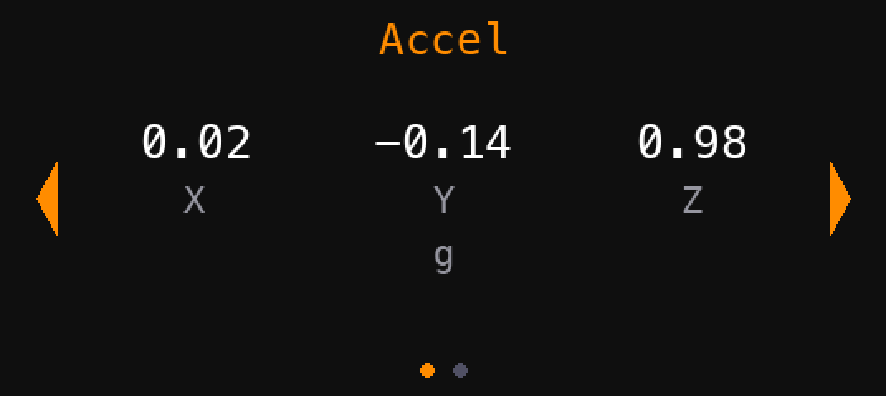
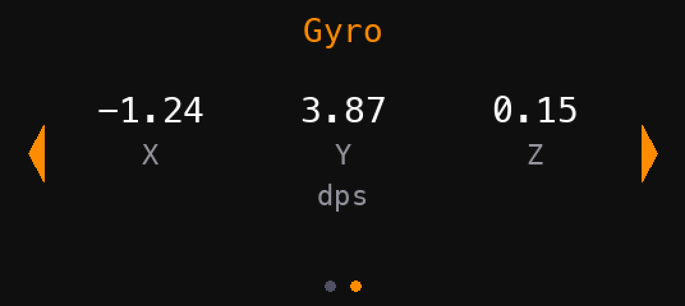
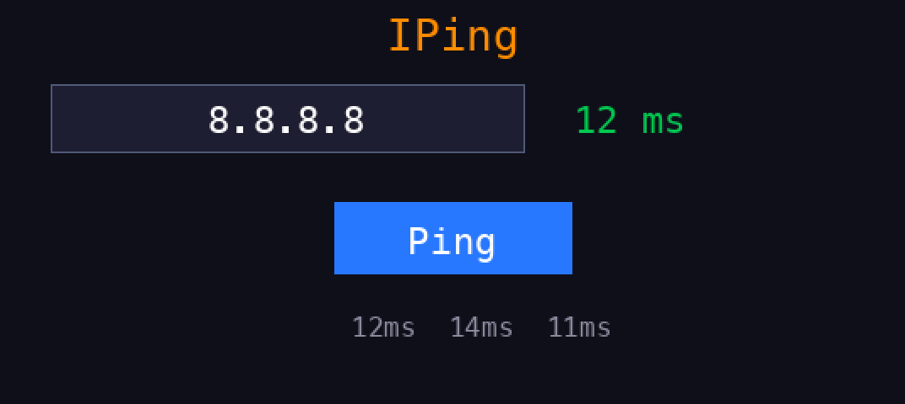
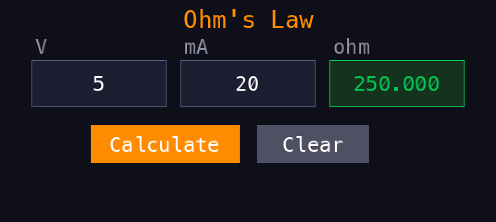
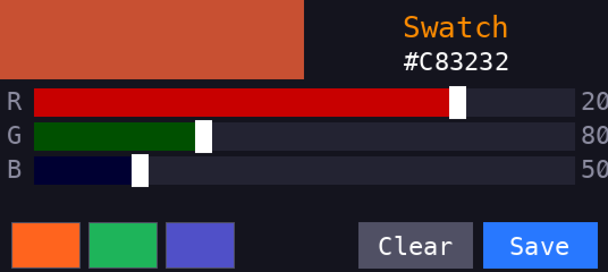
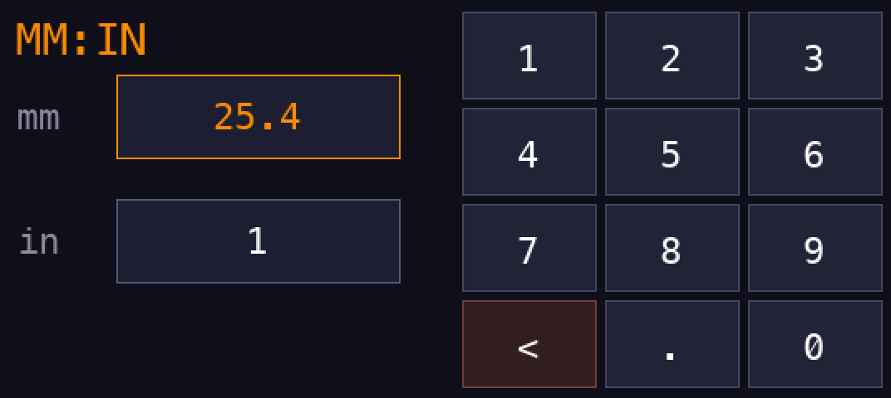
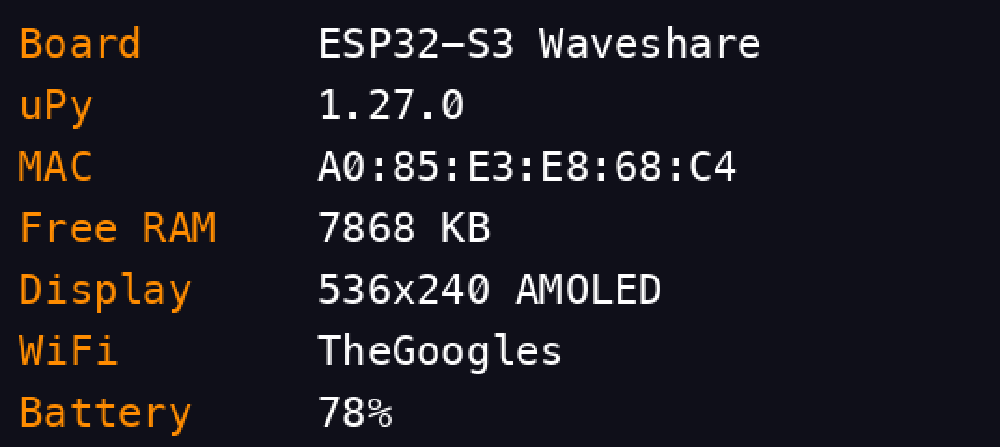

# mote

A MicroPython-based prototyping OS for the **Waveshare ESP32-S3-Touch-AMOLED-1.91** board. Features a touch-navigable app launcher, custom display and touch drivers, and a simple app framework for building mini-applications on a 536x240 AMOLED touchscreen.

## Hardware

| Spec | Detail |
|------|--------|
| Board | Waveshare ESP32-S3-Touch-AMOLED-1.91 (touch variant, pre-soldered headers) |
| MCU | ESP32-S3R8, dual-core LX7, 240 MHz |
| Flash / PSRAM | 16 MB / 8 MB Octal |
| Display | 1.91" AMOLED, 536x240, RM67162 controller over QSPI |
| Touch | FT3168 capacitive touch over I2C |
| Display driver | [dobodu/Lilygo_Waveshare_Amoled_Micropython](https://github.com/dobodu/Lilygo_Waveshare_Amoled_Micropython) (C module baked into firmware) |

### GPIO Map

| Function | GPIO |
|----------|------|
| QSPI_SCK | 47 |
| QSPI_CS | 6 |
| QSPI_D0 / D1 / D2 / D3 | 18 / 7 / 48 / 5 |
| Touch I2C SCL / SDA | 39 / 40 |
| Touch INT (wake) | 41 |
| AMOLED RESET | 17 |
| Home button | 10 |

### Home Button

A momentary push button wired between **GPIO 10** and **GND** serves as the home button.

- **Short press:** Returns to the app launcher from any app.
- **Long press (2 seconds):** Enters deep sleep (hibernate). Press the button again to wake.

GPIO 10 is configured with an internal pull-up resistor, so no external pull-up is needed. Just connect one leg of the button to GPIO 10 (header pin 31, left side) and the other to any GND pin.

### User GPIO Pins

Four GPIO pins are reserved for user projects. These are accessible on the board headers and free of conflicts with display, touch, IMU, and other onboard peripherals.

| Function | GPIO | Header Pin | Notes |
|----------|------|-----------|-------|
| User GPIO 1 | 2 | Pin 6 (right) | ADC1 capable |
| User GPIO 2 | 3 | Pin 7 (right) | ADC1 capable |
| User GPIO 3 | 4 | Pin 32 (left) | Digital I/O |
| User GPIO 4 | 16 | Pin 34 (left) | Digital I/O |

GPIOs 2 and 3 are on ADC1, which works alongside WiFi (unlike ADC2). All four support digital I/O and PWM.

## Firmware

This project requires a custom MicroPython firmware with the `amoled` C module.

**Use `firmware_2025_12_15.bin`** from the [dobodu repo](https://github.com/dobodu/Lilygo_Waveshare_Amoled_Micropython/tree/main/firmware). This is the generic `ESP32_GENERIC_S3` build with 16 MB flash and Octal SPIRAM support.

> **Do not use `firmware_2026_01_05.bin`** — it targets the LILYGO T4-S3 board and claims GPIOs 10-14 at the ESP-IDF level, which blocks the touch I2C on this Waveshare board.

### Flashing

```bash
pip install esptool mpremote

# Download firmware
curl -L -o firmware_2025_12_15.bin \
  https://github.com/dobodu/Lilygo_Waveshare_Amoled_Micropython/raw/main/firmware/firmware_2025_12_15.bin

# Erase and flash (hold BOOT button if port isn't detected)
esptool.py --chip esp32s3 --port $PORT erase_flash
esptool.py --chip esp32s3 --port $PORT \
  --baud 460800 \
  write_flash --flash_mode dio --flash_freq 80m --flash_size 16MB \
  0x0 firmware_2025_12_15.bin
```

Find your serial port:
- **macOS:** `ls /dev/cu.usb*` (typically `/dev/cu.usbmodem*`)
- **Linux:** `ls /dev/ttyACM* /dev/ttyUSB*`
- **Windows:** Device Manager, Ports (COM & LPT)

## Setup

After flashing firmware, upload the project files to the board:

```bash
export PORT=/dev/cu.usbmodem1301  # adjust to your port

# Create directories on the board
mpremote connect $PORT mkdir /fonts
mpremote connect $PORT mkdir /icons

# Upload core files
mpremote connect $PORT cp boot.py :
mpremote connect $PORT cp main.py :
mpremote connect $PORT cp shell.py :
mpremote connect $PORT cp button.py :
mpremote connect $PORT cp ft3168.py :
mpremote connect $PORT cp uping.py :
mpremote connect $PORT cp qmi8658.py :
mpremote connect $PORT cp app_imu.py :
mpremote connect $PORT cp app_iping.py :
mpremote connect $PORT cp app_ohm.py :
mpremote connect $PORT cp app_swatch.py :
mpremote connect $PORT cp app_convert.py :
mpremote connect $PORT cp app_info.py :
mpremote connect $PORT cp app_template.py :
mpremote connect $PORT cp fonts/large.py :/fonts/large.py

# Upload icons (optional - falls back to solid colours)
mpremote connect $PORT cp icons/app_info.bin :/icons/app_info.bin

# Upload your settings
cp settings.json my_settings.json  # edit with your WiFi creds and owner info
mpremote connect $PORT cp my_settings.json :settings.json

# Run it
mpremote connect $PORT run main.py
```

### settings.json

Create a `settings.json` with your WiFi credentials and owner info:

```json
{
    "wifi": {
        "ssid": "YourNetwork",
        "password": "YourPassword"
    },
    "owner": {
        "name": "Your Name",
        "email": "you@example.com"
    }
}
```

This file is gitignored. WiFi connects automatically on boot via `boot.py`.

## Screenshots

| Boot | Launcher | IMU (Accel) |
|------|----------|-------------|
|  |  |  |

| IMU (Gyro) | IPing | Ohm's Law |
|------------|-------|-----------|
|  |  |  |

| Swatch | MM:IN | Sys Info |
|--------|-------|---------|
|  |  |  |

Screenshots are simulated renders. Generate with `python3 tools/gen_screenshots.py`.

## Project Structure

```
mote/
├── main.py              # Boot entry - inits hardware, runs shell
├── boot.py              # WiFi connection on boot
├── shell.py             # App launcher grid with touch navigation
├── button.py            # Home button driver (GPIO 10)
├── ft3168.py            # FT3168 capacitive touch driver
├── qmi8658.py           # QMI8658 6-axis IMU driver
├── uping.py             # ICMP ping module
├── app_imu.py           # IMU viewer (accel + gyro)
├── app_iping.py         # Network ping diagnostic
├── app_ohm.py           # Ohm's Law calculator
├── app_swatch.py        # RGB color mixer
├── app_convert.py       # MM/inches converter
├── app_info.py          # System info (always last in launcher)
├── app_template.py      # App interface template
├── settings.json        # User settings (gitignored)
├── fonts/
│   └── large.py         # Bitmap font, 31px tall
├── icons/               # 40x40 RGB565 icon bitmaps
├── screenshots/         # Simulated UI screenshots
├── examples/            # Demo/test scripts from development
├── tools/
│   ├── png_to_icon.py   # PNG to colour565 icon converter
│   └── gen_screenshots.py  # Screenshot generator
└── docs/                # Flash instructions, known issues
```

## Writing Apps

Each app is a Python module with three exports:

```python
NAME = "My App"      # Display name (max ~12 chars)
ICON = 0xF81F        # Fallback colour565 for the launcher tile

def run(display, touch, font, button):
    # Your app code here
    # display - amoled.AMOLED object (536x240)
    # touch   - FT3168 driver (touch.get_touch() returns (x, y) or None)
    # font    - bitmap font for display.write(font, text, x, y, color)
    # button  - HomeButton driver (button.check() returns True on short press)
    #
    # Return from run() to go back to the launcher.
    # Call button.check() each loop iteration — it returns True on
    # short press (return to launcher) and auto-hibernates on long press.
    pass
```

To add an app to the launcher, add its module name to the `APPS` list in `main.py`.

### App Icons

Icons are optional 40x40 pixel bitmaps in RGB565 format. To create one:

```bash
python3 ./tools/png_to_icon.py input.png [output.bin]
```

The `.bin` filename must match the app module name. Upload to `/icons/` on the board. If no icon exists, the launcher uses the `ICON` colour constant.

## Navigation

- **Launcher:** Tap a tile to open an app. Swipe up/down to scroll if more than 6 apps.
- **Inside apps:** Short-press the home button to return to the launcher.
- **Hibernate:** Long-press the home button (2 seconds) from anywhere to enter deep sleep. Press again to wake.

## Known Issues

- `display.text(None, ...)` and `amoled.TTF()` cause hard C-level crashes. Use `display.write(font, ...)` with the bitmap font only.
- The FT3168 touch controller hibernates when idle. The driver retries wake indefinitely on boot.
- Drawing text partially off-screen crashes the C display driver. Always clip to fully on-screen coordinates.
- Interleaving `fill_rect` and `bitmap` calls at adjacent positions causes silent render failures. Use separate draw passes (backgrounds, then icons, then text).
- No hardware scroll support on the RM67162.
